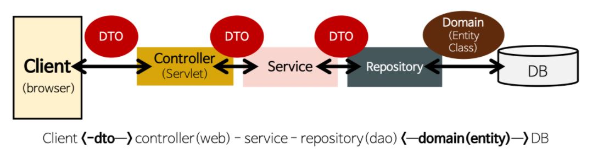

# **Chrome screen time**

- ### mongoDB 연결
    - build.gradle에 추가.
      `implementation 'org.springframework.boot:spring-boot-starter-data-mongodb'`
      
    - src > main > resources > application.properties 에 해당 정보 추가
        `# MONGODB (MongoProperties)
      spring.data.mongodb.uri=mongodb://127.0.0.1:27017/UserDB`
      

- ### mongoDB 구현 공부를 위한 testmongo (src > main > java > sm.chromeScreentime.testmongo)
    1. Customer - DTO 클래스. 
    2. CustomerRepository - DTO 클래스에 DB데이터를 넣어줄 repository 객체 생성
    3. MonogodbappApplication - 정보 받아서 customer에 저장시키고 run 시킨다. 
    

- ### 자이썬 or json 파일 받아서 저장

--------------------------

####DAO - Data Access Object / repository package
- 실제로 db에 접근하는 객체
- 서비스와 db를 연결하는 고리

####DTO - Data Transfer Object / dto package
- 계층간 데이터 교환을 위한 객체( java Beans )
    - DB에서 데이터를 얻어 service나 cotroller 등으로 보낼 때 사용하는 객체
(DB가 서버로 넘어오면 DTO형태로 바껴서 오고 가는 형식)
    - 로직 없는 순수한 데이터 객체고 getter/setter 메서드만 가짐 (임의로 변경할 필요 없으면 setter 필요 없음)
- Request와 Response용 DTO는 view를 위한 클래스
    - 자주 변경이 필요한 클래스일 경우, toEntity( )메서드 통해서 DTO에 필요한 부분을 entity로 만듦.

####Entity class - domain package
- 실제 DB 테이블과 매칭될 클래스 / 가장 코어
`@Entity` `@Id`이용 
  
- 최대한 외부에서 Entity 클래스의 getter method를 사용하지 않게 구현
    - Domain Logic만 가지고 있어야 하고 Presentation Logic을 가지고 있어서는 안됨
    - method는 주로 Service Layer에서 사용한다.
    

[참고]

springBoot와 mongoDB 연동하기 : https://mommoo.tistory.com/79

how to connect springboot to mongoDB database : https://www.youtube.com/watch?v=7-KczUt3BbI

Crawling - Server DB 자동화 프로그램 구성 깃헙 : https://github.com/beaniejoy/do-it-quant/tree/master/src/main/java/com/diq/quant

Crawling - Server DB 자동화 프로그램 구성 원글: https://velog.io/@hanbinleejoy/Spring-Boot-Python%EC%9D%84-%EC%9D%B4%EC%9A%A9%ED%95%9C-%EC%9E%90%EB%A3%8C-%EC%88%98%EC%A7%91-%EC%9E%90%EB%8F%99%ED%99%94

전체 구조 공부 : https://gmlwjd9405.github.io/2018/12/25/difference-dao-dto-entity.html